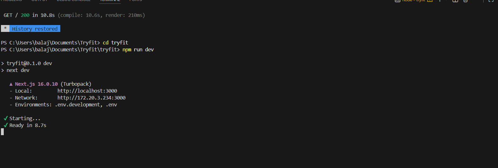

# 🧥 Try-Fit — Project Initialization & Folder Structure
## 📌 Project Overview

Try-Fit is a try-at-home clothing e-commerce platform where users can explore outfits and virtually try them before purchasing.
This repository sets up the base Next.js (TypeScript) structure that will be extended in future sprints.

### 🛠️ Tech Stack

- Next.js (App Router)

- TypeScript

- ESLint

- Node.js

### 📂 Folder Structure
src/
├── app/          # Application routes and pages (App Router)
│   ├── page.tsx  # Home page
│   ├── layout.tsx # Root layout
│
├── components/   # Reusable UI components (buttons, cards, navbar)
│
├── lib/          # Utility functions, helpers, and configurations
│
public/           # Static assets (images, icons)

#### Folder Explanation

app/
Contains all routes and pages using Next.js App Router.
Each folder represents a route, improving clarity and scalability.

components/
Stores reusable UI components to avoid duplication and keep UI logic clean.

lib/
Holds helper functions, constants, and configurations shared across the app.

public/
Stores static assets that can be accessed directly by the browser.

### 🧠 Naming Conventions

Components use PascalCase (e.g., Navbar.tsx)

Utility files use camelCase (e.g., formatDate.ts)

Folder names are lowercase and descriptive

### 🚀 Setup Instructions

1️⃣ Install Dependencies
- npm install

2️⃣ Run the Development Server
- npm run dev

3️⃣ Open in Browser

- Visit 👉 http://localhost:3000

## 📸 Local Run Screenshot

### 🔍 Reflection: Why This Structure?

- Separates routing, UI, and logic, making the codebase easy to understand.

- Encourages reusability and cleaner commits in team collaboration.

- Scales well as new features, pages, and APIs are added in future sprints.

- Reduces merge conflicts by keeping responsibilities clearly divided.

- This structure forms a strong foundation for building a large-scale full-stack application in upcoming sprints.

### ✅ Sprint-1 Outcome

- Next.js TypeScript project initialized successfully

- Standard folder structure implemented

- Project runs locally without errors

- Ready for feature development in future sprints